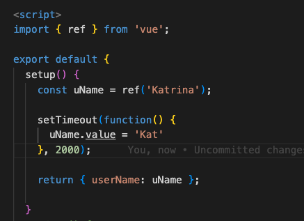

# The Composition API

## Set Up
``npm install``

``npm run serve``

## Learning Journey

**Reactive Values with ref()**



* Vue automatically read the value

```
could be replaced with:

<script setup>
import { ref } from 'vue';
 
const uName = ref('Maximilian');
 
setTimeout(function() {
  uName.value = 'Max';
}, 2000);
</script>
```

* Learn more about <script setup>:  
https://vuejs.org/api/sfc-script-setup.html